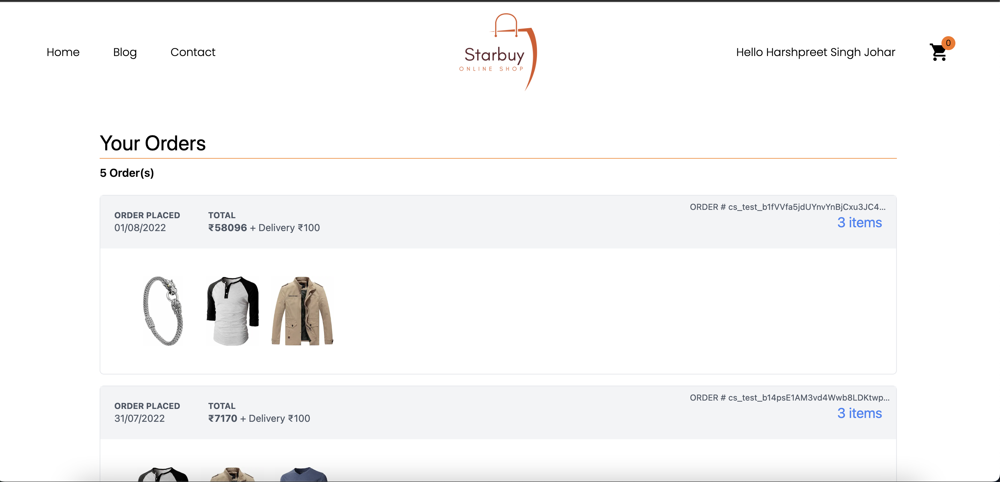
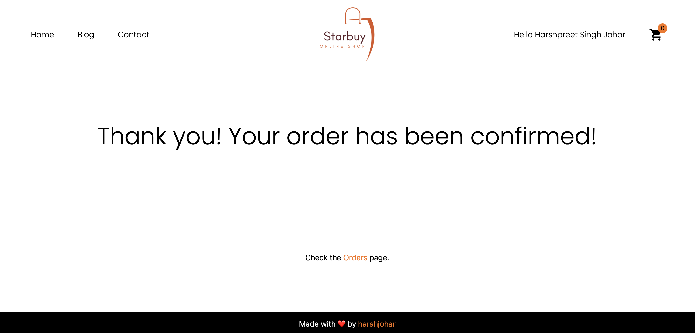
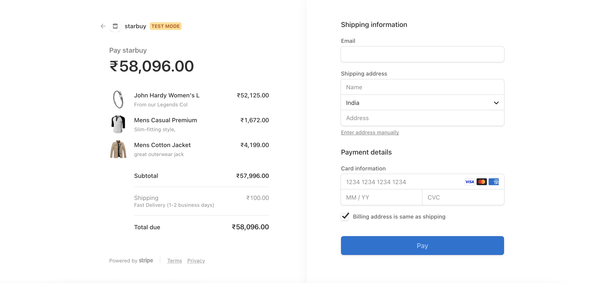

# Starbuy

Starbuy is an e-commerce platform built using NEXTjs and Stripe payment checkout.

## Features
+ Select Products
+ Add to cart
+ Secured payment gateway using card (credit card)
+ Details of previous orders
+ User authentication

## Implementation
Each feature is implemented using the following technologies:

### Products
The product data is taken by fetching an API from the internet called the `Fakestore API`. A list of products, sufficient enoough to test the app) was provided by this API.

### Cart functionality
The cart functionality was implemented using the react library called `REDUX`. Redux is a global state management tool.

### Payment checkout
The payment gateway is implemented using `Stripe`. Stripe is a service which provides payment gateway. 

In this app, card payements using debit/credit cards is permitted. As the app is just for demonstration purposes, only test cards work in this. 

Details of test card 
+ Card number `4242 4242 4242 4242`
+ CVV `424`
+ Exp. date `04/24`

### Previous orders
This part is implemented using the Webhooks, provided by the Stripe.

When the payment is successful, a webhook is triggered which stores the order information in the firestore database.

### User authentication
This part of the website is built on top of the `next-auth` library provided by the nextjs.

## Snapshots of the website

